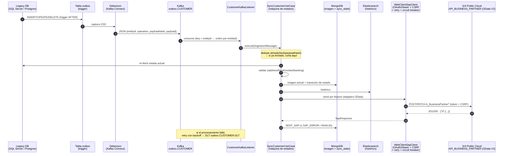
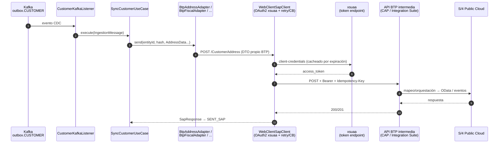
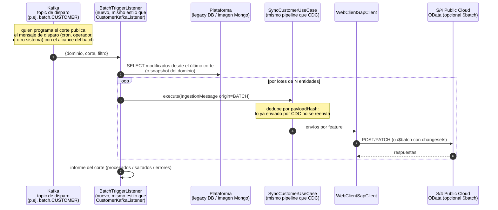
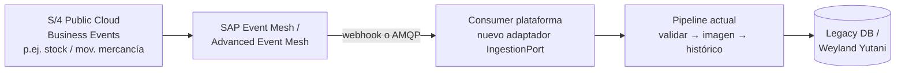

# Patrones de integración con SAP S/4 Public Cloud

> Esquemas visuales de las integraciones plataforma ↔ SAP y su estado real en
> el código. Los diagramas son Mermaid: se renderizan en GitHub y en VS Code
> (extensión *Markdown Preview Mermaid Support*).
>
> Relación con otros docs: [`FLOWS.md`](FLOWS.md) detalla los flujos con
> nombres de clase; [`OVERVIEW.md`](OVERVIEW.md) la arquitectura general;
> [`../integration-guide/README.md`](../integration-guide/README.md) el estado
> por brecha.

## Resumen de estado

| # | Patrón | Dirección | Estado |
|---|--------|-----------|--------|
| 1 | CDC/Kafka → API nativa S/4 (OData) | Plataforma → SAP | ✅ Implementado end-to-end (pendiente validar contra tenant real) |
| 2 | CDC/Kafka → API BTP intermedia | Plataforma → BTP → SAP | ✅ Implementado del lado plataforma; el servicio BTP intermedio no existe aún (contrato placeholder) |
| 3 | Pull: BTP llama a endpoint publicado y actualiza SAP | SAP → Plataforma → SAP | 🔮 Implementación futura |
| 4 | Batch fin de día / D+1 (disparado por topic Kafka) | Plataforma → SAP | 🔮 Implementación futura (reutiliza los mecanismos existentes) |
| 5 | Eventos desde S/4 — principalmente actualización de stock | SAP → Plataforma | 🔮 Implementación futura (pendiente de decisión del equipo SAP) |

---

## Patrón 1 — CDC/Kafka → API nativa de S/4 (casi tiempo real)

Un cambio en la BD legacy acaba en la API OData `API_BUSINESS_PARTNER` de S/4
en segundos, con validación, imagen, histórico y trazabilidad por registro.



**Estado**: implementado. Clases: `CustomerKafkaListener` →
`SyncCustomerUseCase` → `BusinessPartner*ODataAdapter` (activados por
`sap.odata.*.enabled`) → `WebClientSapClient`. Infra local completa en
`external-services/` (outbox + triggers + Debezium + conectores).
**Pendiente**: validar payloads contra tenant real; reprocesador de
`SAP_ERROR` por feature (reintento hacia delante) para el fallo parcial
multi-feature.

---

## Patrón 2 — CDC/Kafka → API BTP intermedia

Mismo pipeline, pero el destino es una **API propia desplegada en BTP**
(CAP app o iFlow de Integration Suite) que encapsula la lógica de entrada a
SAP: mapeos finos, enriquecimiento, orquestación de varios servicios S/4.



**Estado**: el lado plataforma está implementado (`Btp*Adapter` con DTOs
propios, destino `SapDestination.BTP`, OAuth2 xsuaa real con fallback stub).
**Lo que falta es el otro extremo**: la API BTP intermedia **no existe
todavía** — los paths (`/CustomerAddress`, ...) y los DTOs son un contrato
placeholder que hay que fijar cuando se decida la tecnología del
intermediario (CAP vs Integration Suite). Los adaptadores BTP y OData son
excluyentes por configuración (`sap.odata.<feature>.enabled`): cada feature
puede enrutar por el patrón 1 o el 2 sin tocar código.

---

# Implementación futura (se definirá e implementará más adelante)

Los tres patrones siguientes están identificados y acordados como evolución
de la plataforma, pero **aún no están contemplados en el código**. Se
documentan aquí para que el inventario de integraciones esté completo.

## Patrón 3 — Pull: BTP llama a un endpoint publicado, obtiene datos y actualiza SAP

Aquí la iniciativa es de SAP: un job/iFlow en BTP consulta un **endpoint
publicado por la plataforma**, transforma la respuesta y actualiza S/4. Útil
cuando SAP marca el ritmo (cargas programadas desde el lado SAP, consultas
bajo demanda desde Fiori, reconciliaciones).

```mermaid
sequenceDiagram
    autonumber
    participant S4 as S/4 Public Cloud
    participant BTP as BTP<br/>(iFlow / CAP job / scheduler)
    participant GW as Endpoint publicado<br/>(plataforma, p.ej.<br/>GET /customers/{id} ó /customers/pending)
    participant ST as MongoDB<br/>(imagen actual)
    participant DB as Legacy DB<br/>(si se requiere dato vivo)

    BTP->>GW: GET + OAuth2 (token xsuaa validado por la plataforma)
    GW->>ST: leer imagen actual (rápido, sin tocar legacy)
    alt dato no disponible / stale
        GW->>DB: fetch legacy
    end
    GW-->>BTP: JSON (contrato de exportación versionado)
    BTP->>BTP: mapear a A_BusinessPartner*
    BTP->>S4: OData create/update ($batch si es masivo)
    S4-->>BTP: resultado
    Note over BTP,GW: reintentos/paginación los gobierna BTP;<br/>la plataforma solo garantiza idempotencia de lectura
```

**Punto de partida en el código**: `sap.integration.mode: push|pull|both`
existe como property (hoy sin efecto); los flujos 2 y 4 de
[`FLOWS.md`](FLOWS.md) describen los controllers propuestos;
`BusinessPartnerReadAdapter`/`BusinessPartnerReadPort` (lectura de SAP,
sin consumidores aún) cubrirían la variante inversa.
**Faltaría**: endpoint(s) GET con contrato versionado y paginación,
validación del token entrante (resource server contra xsuaa), y del lado BTP
el job/iFlow con su mapeo y el update OData idempotente.

## Patrón 4 — Batch fin de día / D+1, disparado por topic Kafka

Las cargas batch **reutilizarán los mecanismos ya existentes**: un mensaje en
un topic Kafka dedicado dispara el proceso — la app consulta los datos en la
plataforma y los envía a SAP por los mismos adaptadores del patrón 1/2. No
hace falta pipeline nuevo: solo el listener del topic de disparo y,
opcionalmente, soporte `$batch` para agrupar envíos masivos.



**Ventaja del diseño actual**: `IngestionPort` ya anticipa múltiples fuentes y
el dedupe por `payloadHash` hace que CDC y batch convivan sin duplicar envíos
— implementar esto es añadir un listener/adaptador, no tocar el pipeline. El
soporte `$batch` (agrupar operaciones por request, con changesets atómicos)
habría que añadirlo a `SapClient`; la spec oficial ya documenta el endpoint
`/$batch`.

## Patrón 5 — Eventos desde S/4 hacia la plataforma (principalmente stock)

El sentido inverso: S/4 Public Cloud publica **Business Events** vía SAP Event
Mesh / Advanced Event Mesh y la plataforma los consume. El caso de uso
principal identificado es la **actualización de stock** (movimientos de
mercancía y existencias que nacen en SAP y deben reflejarse en la
plataforma). **Pendiente de la decisión del equipo de SAP** sobre el
mecanismo de publicación (Event Mesh, webhook del iFlow, u otro).



Sin diseño cerrado: cuando el equipo de SAP confirme el mecanismo, el
consumer encaja como un adaptador más de `IngestionPort` reutilizando el
pipeline actual (validación, imagen, histórico, trazabilidad).

---

Términos y siglas de este documento: ver el glosario general del proyecto,
[`../GLOSSARY.md`](../GLOSSARY.md).
