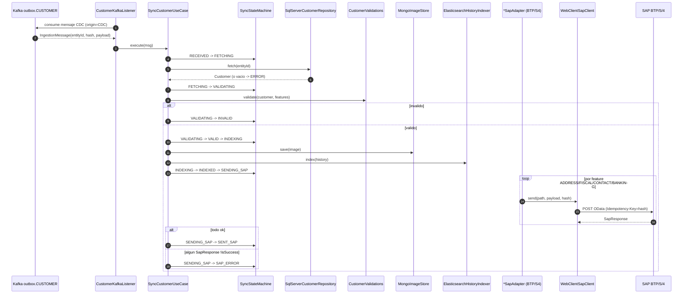

# Guía de Integración (PoC)

> PoC de sincronización hacia SAP. Esto es solo un mapa general; el código es la fuente de verdad. Para detalle, ver `../architecture/OVERVIEW.md`, `../specs/SPEC.md`, `../specs/TECH.md`.

## Qué hace

Ingesta CDC (Kafka outbox) y REST → fetch legacy → validar → indexar (Mongo + ES) → enviar a SAP BTP/S4. Trazabilidad vía `SyncStateMachine` (12 estados) persistida en Mongo.

## Stack

Java 23/25 · Spring Boot 4.0 · Maven multi-módulo (`common`, `customer` :8081, `article` :8082, `supplier` placeholder, `it`) · hexagonal. SAP Cloud SDK 5.32, Resilience4j, Spring Kafka, JPA (SQLServer/Postgres), Mongo, ES, OTel.

## Mapa de proceso (flujo CDC Customer)

## Integraciones

| Sistema | Protocolo | Flujo | Auth | Puntos de fallo clave |
|---|---|---|---|---|
| SAP BTP (xsuaa) | HTTPS/OData POST | Salida Customer ADDRESS/FISCAL/CONTACT/DELETE | OAuth2 (STUB) | auth stub; retry no dispara; sin timeout; sin mapeo errores; DELETE como POST |
| SAP S/4 Cloud | HTTPS/OData POST | Salida Customer BANKING + Article | OAuth2/username (STUB) | idem + mandates nulos |
| Kafka (CDC) | Kafka consumer | Entrada outbox.CUSTOMER/outbox.ARTICLE | plain | sin DLQ; sin idempotencia de consumo; Debezium no cableado |
| SQL Server | JDBC/JPA | Lectura Customer legacy | user/pass | ddl-auto=validate; Status.valueOf sin fallback valor invalido |
| PostgreSQL | JDBC/JPA | Lectura Article legacy | user/pass | idem, sin fallback status |
| MongoDB | driver | Imagen actual + estado sync | none | race condition en transition; _id no unico; historial pierde estado origen |
| Elasticsearch | HTTP REST | Historico indexado | none | sin fallback si ES cae, pipeline aborta en INDEXING |
| OpenTelemetry | OTLP | Metricas/trazas | none | collector externalizado |

Estados SAP: `RECEIVED -> FETCHING -> VALIDATING -> {VALID|INVALID} -> INDEXING -> INDEXED -> SENDING_SAP -> {SENT_SAP|SAP_ERROR}`, con `ERROR` y `COMMUNICATION_ERROR` recuperables.

## Brechas conocidas (PoC)

Estas son limitaciones conscientes del PoC, no bugs por priorizar salvo que se vaya a producción:

| Brecha | Dónde | Impacto |
|---|---|---|
| Auth SAP es stub | `BtpAuthProvider.java:30`, `S4NativeAuthProvider.java:29` | inviable prod |
| Retry Resilience4j no dispara | `WebClientSapClient.java:70-77` | fallos transitorios no reintentan |
| Sin DLQ Kafka | `CustomerKafkaListener.java:40-43` | mensajes venenosos perdidos |
| Sin timeout WebClient SAP | `WebClientSapClient.java:41-42` | cuelgues indefinidos |
| Sin mapeo errores SAP | `WebClientSapClient.java:64` | diagnostico deficiente |
| Debezium/outbox no cableado | sin config/DDL | CDC no end-to-end desde el repo |
| Sin idempotencia de consumo | sin dedup por hash | reentregas duplican efectos |
| Race condition en estado sync | `MongoSyncStateRepository.java:31-36` | inconsistencias bajo concurrencia |
| `supplier` vacio + MinIO sin uso | `SupplierApplicationPlaceholder`, compose | dominio/infra no operativos |

## Cómo extender (patron)

Para añadir un dominio nuevo (p.ej. `supplier` real):
1. Módulo `supplier/` con paquetes `domain/application/adapters/bootstrap`; añadir a `<modules>` del parent `pom.xml`.
2. Declarar dependencia a `common`. Reutilizar `SyncStateMachine` y `MongoSyncStateRepository` (no tocar).
3. Aggregate + ports (`LegacyRepositoryPort`, `ImageStorePort`, `HistoryIndexerPort`) + adaptadores + `Sync<Dom>UseCase`.
4. `@SpringBootApplication` + `@KafkaListener(topic outbox.<DOM>)` + `POST /<dom>/sync`.
5. `application.yml` con `spring.config.import=application-common.yml`; env vars (`*_SERVER_PORT`, DB, etc.).
6. DDL legacy en `external-services/.../init.sql`; tests con Testcontainers + WireMock SAP.

Para nueva feature de Customer: VO + validador + `<FEAT>` en `CustomerFeature` + `*SapPort` + adaptador + `Sync<Feat>UseCase`; registrar dispatch en `SyncCustomerUseCase.java:103`.

## Supuestos PoC

- Auth SAP: stub hasta que se decida (env vars o BTP Destination Service).
- Cliente HTTP SAP definitivo: `WebClientSapClient`. `sap-sdk-client/` es spike OpenAPI desechable.
- Debezium/outbox: responsabilidad externa al repo.
- `supplier`: futuro, patron simple como `article`.
- MinIO: sin uso; posible futuro `S3ImageStoreAdapter` si hace falta blob storage.

## Referencias

- Especificacion funcional: `../specs/SPEC.md`
- Stack detallado: `../specs/TECH.md`
- Vision general con ASCII diagrams: `../architecture/OVERVIEW.md`
- SAP Cloud SDK (spike): `../integrations/SAP_CLOUD_SDK.md`
- Tests: `../testing/TESTING.md`
- Glosario: `../GLOSSARY.md`
